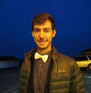

Alex Rowe grew up in San Diego, California, and went to college at the University of California,
Cruz (UCSC). He graduated with a Bachelor in Physics in 2014. After placing second in the 2014 UCSC Hackathon,
He was hired at X2CRM doing full stack development. He took a break from the coding lifestyle and
was a camp counselor in Washington state for the summer of 2015. After returning, he was hired for what became a
senior development job at Gravity Current, a music visualization startup. There he does development
on a product called Synesthesia.

