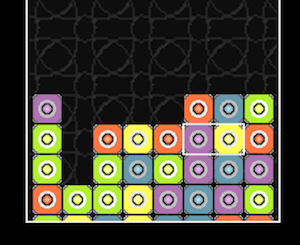

Puzzle League is a browser game made in CoffeeScript. It replicates the gameplay of games such as Tetris Attack and Pokémon Puzzle League. The pixel art, music and coding was all done by myself. It was enjoyable to see it come together as a finished game.
I used CreateJS as a framework for it, which isn't necessarily a game engine,
it was fun to create my own mini game framework in the process.

### [Play it here](/puzzle_league)

## Links
  - [Puzzle League on github](https://github.com/aprowe/PuzzleLeague)

## Tech Used
 - CoffeeScript
 - Grunt
 - [CreateJS](http://www.createjs.com/)
 - Ableton Live
 - [Piskel](http://www.piskelapp.com/)

